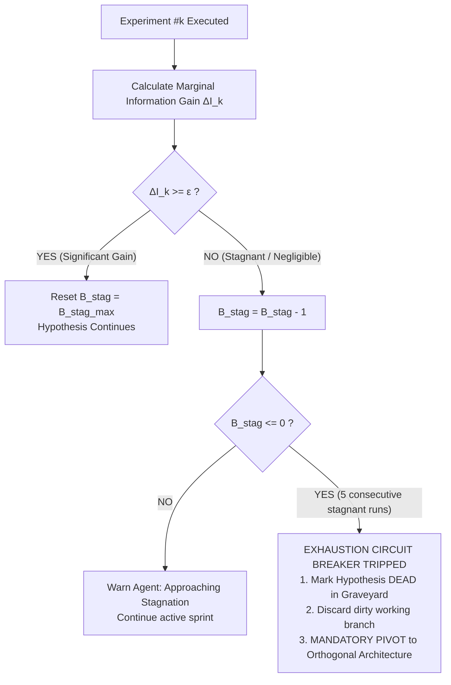

# 📊 Multi-Dimensional Research Budget Architecture

## 1. Architectural Vision: Beyond the Naive 1D Iteration Limit

Most autonomous AI agent architectures control execution lifecycles through a single, scalar integer:

```python
# Naive Industry Antipattern
max_iterations = 50
for step in range(max_iterations):
    agent.step()
```

This scalar model exhibits four fatal architectural flaws:
1. **Resource Blindness:** 50 microsecond-level scalar loops consume negligible compute, whereas 50 multi-megabyte document retrievals exhaust hundreds of thousands of tokens and minutes of wall-clock time. A 1D counter treats them as identical.
2. **Infinite Search Blackholes:** An agent can spend 45 iterations issuing superficial search queries without ever writing a line of code or testing an empirical hypothesis.
3. **Stagnant Experiment Thrashing:** An agent can perform 15 consecutive code edits that yield $\Delta I \approx 0$ (zero information gain), burning quota without recognizing that its foundational hypothesis is dead.
4. **Premature Truncation:** An agent progressing rapidly with high velocity and ample token budget is abruptly killed simply because step 50 arrived.

The **Multi-Dimensional Research Budget Architecture** replaces scalar iteration counters with a **6-Dimensional Resource Allocation Tensor** $\vec{B}(t)$ governed by deterministic exhaustion state machines.

---

## 2. The 6-Dimensional Research Budget Tensor

```text
                                RESEARCH BUDGET TENSOR B(t)
                                             │
      ┌──────────────┬──────────────┬────────┼──────────────┬──────────────┬──────────────┐
      ▼              ▼              ▼        ▼              ▼              ▼              ▼
┌───────────┐  ┌───────────┐  ┌───────────┐  ┌───────────┐  ┌───────────┐  ┌───────────┐
│   TOKEN   │  │   TIME    │  │EXPERIMENT │  │  SEARCH   │  │HYPOTHESIS │  │STAGNATION │
│  BUDGET   │  │  BUDGET   │  │  BUDGET   │  │  BUDGET   │  │  BUDGET   │  │  BUDGET   │
├───────────┤  ├───────────┤  ├───────────┤  ├───────────┤  ├───────────┤  ├───────────┤
│ B_token   │  │ B_time    │  │ B_exp     │  │ B_search  │  │ B_hyp     │  │ B_stag    │
│ Context & │  │ Wall-clock│  │ Concrete  │  │ External  │  │ Distinct  │  │ Consec.   │
│ Cumulative│  │ duration  │  │ code runs │  │ discovery │  │ conceptual│  │ zero-gain │
│ inference │  │ per sprint│  │ & tests   │  │ queries   │  │ branches  │  │ trials    │
└─────┬─────┘  └─────┬─────┘  └─────┬─────┘  └─────┬─────┘  └─────┬─────┘  └─────┬─────┘
      │              │              │              │              │              │
      └──────────────┴──────────────┴───────┬──────┴──────────────┴──────────────┘
                                            ▼
                           ┌─────────────────────────────────┐
                           │   BUDGET GOVERNANCE CONTROLLER  │
                           │   • Real-Time Burn Telemetry    │
                           │   • Amber Warning Alert (>=75%) │
                           │   • Exhaustion Circuit Breakers │
                           └────────────────┬────────────────┘
                                            │
                                            ▼
                           ┌─────────────────────────────────┐
                           │    EXHAUSTION STATE MACHINE     │
                           │    [CLAMP / SYNTHESIZE / PIVOT] │
                           └─────────────────────────────────┘
```

$$\vec{B}(t) = \begin{bmatrix} B_{\text{token}}(t) \\ B_{\text{time}}(t) \\ B_{\text{exp}}(t) \\ B_{\text{search}}(t) \\ B_{\text{hyp}}(t) \\ B_{\text{stag}}(t) \end{bmatrix}, \quad \vec{B}(0) = \begin{bmatrix} \text{Max Tokens} \\ \text{Max Seconds} \\ \text{Max Concrete Runs} \\ \text{Max Discovery Queries} \\ \text{Max Hypotheses} \\ \text{Max Stagnant Trials} \end{bmatrix}$$

---

## 3. Budget Dimensions & Exhaustion Behaviors

| Dimension | Typical Quota | Consumption Metric | Behavior Upon Exhaustion ($B_i \le 0$) |
| :--- | :--- | :--- | :--- |
| **1. Token Budget ($B_{\text{token}}$)** | $100\text{k} - 250\text{k}$ | Input + Output inference tokens | **Graceful Freeze:** Force immediate summary and save state; forbid further tool execution. |
| **2. Time Budget ($B_{\text{time}}$)** | $300\text{s} - 900\text{s}$ | Wall-clock elapsed runtime | **Sprint Checkpoint:** Halt active loop, output progress artifact, request user alignment. |
| **3. Experiment Budget ($B_{\text{exp}}$)** | $10 - 20$ runs | Concrete `run_command` / test trials | **Empirical Clamp:** Stop trial-and-error edits; force synthesis of accumulated data. |
| **4. Search Budget ($B_{\text{search}}$)** | $6 - 10$ queries | Web searches, symbol lookups, greps | **Search Clamp:** Block all discovery tools; force agent to proceed using existing context. |
| **5. Hypothesis Budget ($B_{\text{hyp}}$)** | $3 - 5$ branches | Number of distinct $H_i$ formulated | **Exploration Cap:** Prohibit spawning new hypotheses; force evaluation of active candidates. |
| **6. Stagnation Budget ($B_{\text{stag}}$)** | $3 - 5$ trials | Consecutive runs with $\Delta I < \epsilon$ | **Mandatory PIVOT:** Mark current branch `DEAD` and force radical architectural pivot. |

---

## 4. The Stagnation Budget Calculus: Epistemic Entropy & Forced Pivot

The most critical innovation of this architecture is **$B_{\text{stag}}$ (Stagnation Budget)**.

### 4.1 Marginal Information Gain Definition
For any experiment or trial $k \in [1, N]$, let $\Delta I_k$ represent the marginal epistemic gain:

$$\Delta I_k = \alpha \cdot \Delta_{\text{metric}} + (1 - \alpha) \cdot \Big(1 - J(D_k, D_{<k})\Big)$$

Where:
* $\Delta_{\text{metric}}$ is the normalized improvement in the target objective (e.g. latency, throughput, error reduction).
* $J(D_k, D_{<k})$ is the Jaccard overlap of observed diagnostic signatures against prior experiments.
* An experiment is **epistemically stagnant** if $\Delta I_k < \epsilon$ (calibrated at $\epsilon = 0.05$).

### 4.2 Stagnation Depletion Law
$$B_{\text{stag}}(t) = B_{\text{stag}}(t-1) - \begin{cases} 1 & \text{if } \Delta I_t < \epsilon \\ -B_{\text{stag}}(0) & \text{if } \Delta I_t \ge 0.20 \text{ (Full Reset on Breakthrough)} \end{cases}$$



* **The Concrete Rule:** If an agent conducts **5 consecutive experiments** without producing significant marginal information gain ($\sum_{k=1}^5 \Delta I_k < 5\epsilon$), **the Stagnation Budget is completely exhausted**.
* The agent is **forbidden** from continuing down that architectural path. The Research Manager immediately issues a `PIVOT` directive.

---

## 5. Dynamic Budget Re-balancing & Cross-Allocation

The controller dynamically adjusts secondary budgets based on experimental velocity:

```text
Velocity = (Delta_Metric / Elapsed_Tokens)
```

1. **High-Velocity Surge:** If an experiment achieves $\Delta_{\text{metric}} > 50\%$ with high statistical significance ($p < 0.01$), the controller dynamically expands $B_{\text{exp}}$ by $+5$ to allow deeper exploitation of the breakthrough.
2. **Search Starvation:** If $B_{\text{search}}$ is exhausted while $B_{\text{exp}}$ remains high, the agent is forced into an **Implementation Phase** where it must construct tests and benchmark prototypes rather than reading documentation.
3. **Graceful Exhaustion Fallback:** If any global hard budget ($B_{\text{token}}$ or $B_{\text{time}}$) reaches $10\%$, the system shifts into **Survival Protocol**:
   * Stashes unverified changes.
   * Restores passing baseline.
   * Compiles research findings into an actionable markdown report for human engineers.
