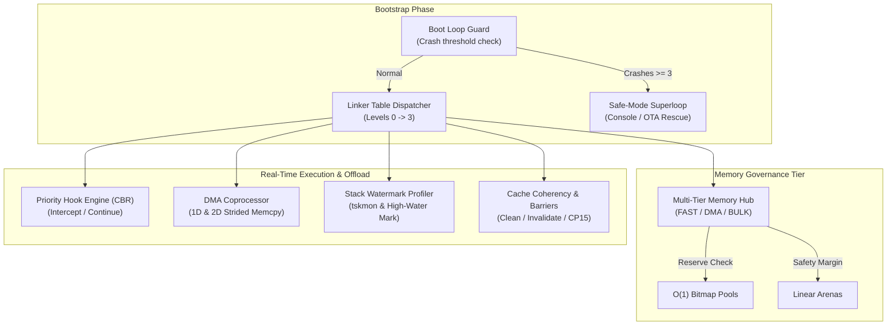

# Real-Time Embedded Architecture & Resilient Firmware Patterns

## 1. Executive Summary

This architecture specification codifies the core design patterns and low-level firmware engineering principles synthesized from production embedded systems (e.g., Magic Lantern on Canon DIGIC/DryOS and ZeroEmbedded on ARM/RISC-V). It addresses determinism, memory fragmentation, non-intrusive event hooking, hardware DMA offloading, stack safety, and crash loop mitigation under real-time constraints.

---

## 2. Core Architectural Invariants

| Invariant | Principle | Rationale |
| :--- | :--- | :--- |
| **Zero Dynamic Heap in Hot Paths** | Forbid `malloc`/`free` in loops $\ge 30\text{ fps}$ and ISRs. | Eliminates non-deterministic latency and heap fragmentation crashes (e.g., ERR 70/80). |
| **Linker Table Decoupling** | Subsystems register via ELF linker sections or compiler attributes. | Eliminates centralized initialization coupling in `main()`. |
| **Multi-Tier Memory Governance** | Route allocations by tier (`FAST`, `DMA`, `BULK`) with reserve limits. | Protects OS/RTOS from memory starvation through hard watermark barriers. |
| **Non-Intrusive Priority Hooking** | Intercept hardware and state events via prioritized CBR chains. | Modules can override or filter execution flow (`STOP` vs `CONTINUE`) without hacking vendor ROM. |
| **Hardware DMA as Coprocessor** | Offload memory copies and 2D strided block transfers to DMA. | Frees CPU cycles for real-time control and algorithm execution. |
| **Deterministic Stack Watermarking** | Paint canary patterns before execution; measure peak stack usage. | Prevents silent stack overflows and enables precise stack sizing. |
| **Boot Loop Resilience** | Guard consecutive boot failures with automatic Safe-Mode fallback. | Prevents persistent bricking caused by corrupted configs or faulty extensions. |

---

## 3. Seven Architectural Patterns

### Pattern 1: Linker Table Auto-Registration
* **Problem**: Centralized `main()` calling every subsystem init creates tight coupling and breaks modular plugin architectures.
* **Solution**: Place entry descriptors into compiler-generated linker sections (or constructor tables):
  ```c
  #define FW_INIT_EXPORT(fn, level, priority) \
      static const fw_init_entry_t __init_##fn \
      __attribute__((used, section(".zero_init." #level))) = { \
          .name = #fn, .init_fn = fn, .level = level, .priority = priority \
      }
  ```
* **Execution**: During bootstrap, an iterator walks levels (`EARLY` $\to$ `CORE` $\to$ `DRIVER` $\to$ `APP`) and dispatches sorted by priority.

### Pattern 2: Multi-Tier Memory Hub & Watermark Governor
* **Problem**: Microcontrollers feature heterogeneous memory regions (TCM/SRAM, uncached DMA RAM, external PSRAM/SDRAM). A single naive heap fragments quickly and starves critical OS pools.
* **Solution**: A Multi-Tier Memory Router managing pools and arenas across discrete tiers:
  * `FW_MEM_TIER_FAST`: High-speed internal SRAM / TCM for DSP and crypto.
  * `FW_MEM_TIER_DMA`: Coherent or uncached memory for peripheral DMA descriptors and ringbuffers.
  * `FW_MEM_TIER_BULK`: External PSRAM/SDRAM for bulk framebuffers.
* **Governor Policy**: Each backend enforces `reserve_bytes`. Allocations that would drop available headroom below `reserve_bytes` are rejected or forced to fallback, preserving OS stability.

### Pattern 3: Priority Event Hook Engine (CallBack Routine / CBR)
* **Problem**: Subsystems must hook into hardware interrupts or state machine transitions (VSYNC, shutter, keypad) without modifying base firmware or vendor SDKs.
* **Solution**: A zero-heap, priority-ordered hook table:
  ```c
  typedef enum { FW_HOOK_STOP = 0, FW_HOOK_CONTINUE = 1 } fw_hook_action_t;
  typedef fw_hook_action_t (*fw_hook_fn_t)(uint32_t event_id, void *data, void *cookie);
  ```
* **Semantics**:
  * Higher-priority hooks execute first.
  * Any hook returning `FW_HOOK_STOP` immediately halts the chain, enabling event interception, parameter overriding, or action suppression.

### Pattern 4: DMA Memory Coprocessor & 2D Strided Transfer
* **Problem**: Copying large data blocks or cropping 2D sensor regions in software wastes CPU cycles and induces jitter in concurrent tasks.
* **Solution**: Treat DMA controllers (e.g., EDMAC, STM32 DMA2D, Mem2Mem DMA) as general memory coprocessors:
  * Word-aligned 1D block copy (`fw_dma_memcpy`).
  * 2D rectangular strided transfer (`fw_dma_copy_2d` with source pitch, destination pitch, width, height) to crop framebuffers or matrix tiles directly via hardware bus.

### Pattern 5: Stack Watermark Canary Profiler
* **Problem**: Stack overflows are notoriously difficult to debug in bare-metal RTOS, causing corrupt global state or random resets.
* **Solution**:
  1. Pre-fill stack buffer with a 32-bit canary pattern (`0x5A5A5A5A`) at task creation.
  2. Scan from stack boundary upwards to find the lowest uncorrupted canary word.
  3. Calculate exact peak consumption: $\text{Peak} = \text{StackSize} - \text{UnusedBytes}$.
  4. Right-size stack allocations based on empirical empirical high-water marks.

### Pattern 6: Cross-Generation Barriers & Explicit Cache Coherency
* **Problem**: Architecture differences (e.g., ARMv5TE without `DMB` vs ARMv7-M with `DMB`, or architectures lacking hardware cache snoop controllers) cause silent data corruption during DMA.
* **Solution**:
  * Adaptive memory barriers:
    * ARM pre-v7 (ARM946E-S): CP15 Drain Write Buffer (`mcr p15, 0, r0, c7, c10, 4`).
    * ARMv7+ / Cortex-M: `dmb 0xF`.
    * RISC-V: `fence rw, rw`.
  * Explicit Cache Coherency lifecycle:
    * Before peripheral TX DMA: `fw_cache_clean(addr, size)` (write dirty cache to RAM).
    * After peripheral RX DMA: `fw_cache_invalidate(addr, size)` (discard stale cache lines).
    * Enforce cache-line alignment (`FW_CACHE_ALIGNED(32)`).

### Pattern 7: Boot Loop Guard & Automatic Safe-Mode Recovery
* **Problem**: A crash during startup (faulty config, corrupted storage, crashing module) causes an infinite watchdog reboot loop, bricking the device.
* **Solution**:
  * Store consecutive crash counter in persistent RTC backup registers or NVS.
  * Increment crash counter at boot; clear counter upon reaching a stable post-init milestone (`fw_boot_guard_mark_success`).
  * If consecutive crashes exceed threshold (e.g., 3):
    * Trip `safe_mode_active = true`.
    * Bypass all optional modules and peripherals.
    * Fall back into minimal rescue superloop (UART Console / OTA recovery only).

---

## 4. Architectural Relationship Diagram


