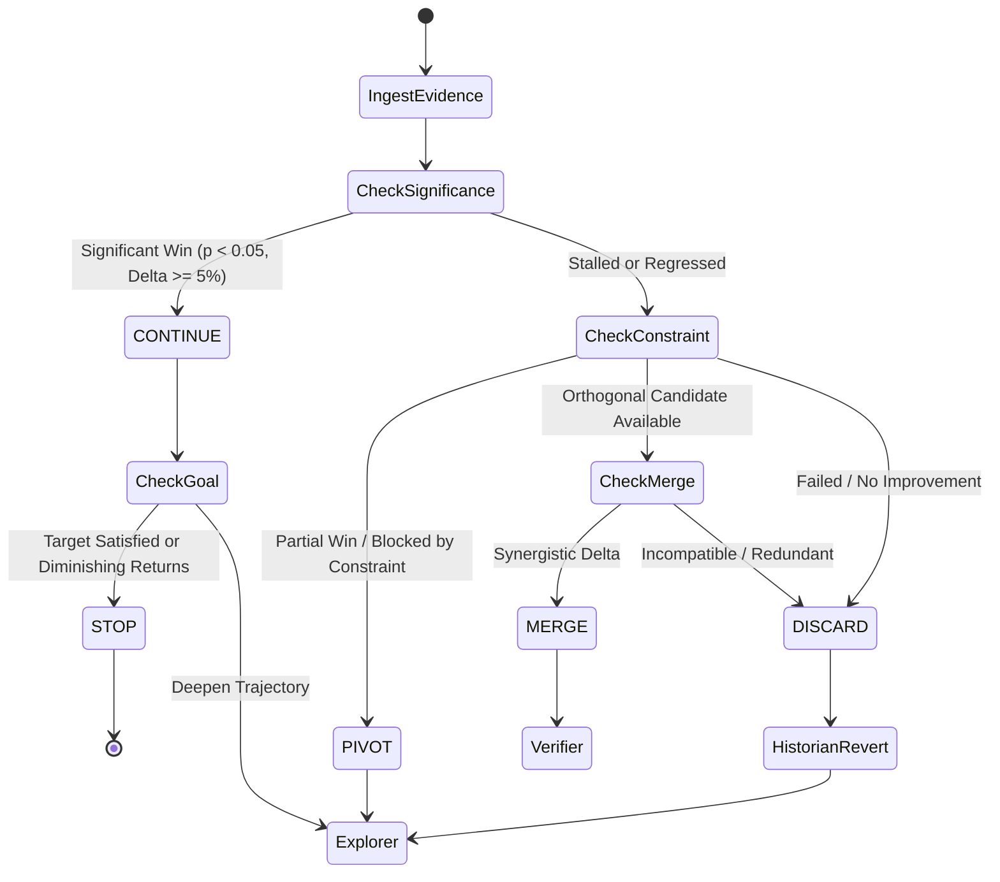

# 🏛️ Research Manager Orchestration Architecture

## 1. Architectural Vision

The single most destructive failure mode of autonomous AI coding agents in open-ended engineering, performance tuning, and deep debugging is the **Dead Loop (Infinite Micro-Fix Trap)**. 

When a code modification fails to produce an expected improvement, an unmanaged agent defaults to stochastic hill-climbing: it generates Experiment #2, #3, ... #17, making microscopic syntactic or algorithmic variations of the **exact same failed conceptual approach**. This burns inference budgets, introduces compounding regressions, and causes context amnesia.

The **Research Manager Orchestration Architecture** solves this by establishing an executive supervisory meta-layer that strictly decouples **Hypothesis Generation**, **Empirical Measurement**, and **Negative Memory**, mediated by a deterministic **5-Way Decision Gate**.

---

## 2. Core Architecture Matrix: The Triad & The Manager

```text
                        ┌────────────────────────────────────────────────────────┐
                        │              RESEARCH MANAGER (SUPERVISOR)             │
                        │       Meta-Cognitive Governor & Decision Arbiter       │
                        └───────────────────────────┬────────────────────────────┘
                                                    │
                   ┌────────────────────────────────┼────────────────────────────────┐
                   ▼                                ▼                                ▼
    ┌─────────────────────────────┐  ┌─────────────────────────────┐  ┌─────────────────────────────┐
    │          EXPLORER           │  │          VERIFIER           │  │          HISTORIAN          │
    │  • Solution Space Search    │  │  • Empirical Benchmarks     │  │  • Dead Hypothesis Graveyard│
    │  • Hypothesis Generation    │  │  • Test-Time Verification   │  │  • Negative Constraint Log  │
    │  • Candidate Patch Authoring│  │  • Statistical Significance │  │  • Anti-Amnesia Memory      │
    └──────────────┬──────────────┘  └──────────────┬──────────────┘  └──────────────┬──────────────┘
                   │                                │                                │
                   └────────────────────────────────┼────────────────────────────────┘
                                                    ▼
                                     ┌─────────────────────────────┐
                                     │        DECISION GATE        │
                                     │  [Strict 5-Way Resolution]  │
                                     └──────────────┬──────────────┘
                                                    │
          ┌──────────────────┬──────────────────────┼──────────────────────┬──────────────────┐
          ▼                  ▼                      ▼                      ▼                  ▼
     [CONTINUE]           [PIVOT]                [MERGE]               [DISCARD]            [STOP]
   (Deepen winner)    (Rotate angle)        (Combine partials)     (Kill hypothesis)    (Goal reached)
```

---

## 3. Subsystem Role Separation

### 3.1 The Explorer (Hypothesis & Solution Search)
* **Responsibility:** Probes unexplored areas of the solution space; synthesizes orthogonal approaches.
* **Invariant:** Cannot self-evaluate its own solutions. Must never mutate the working tree without submitting a formal hypothesis ($H$) and pre-declared falsification threshold to the Manager.
* **Negative Memory Constraint:** Prior to generating candidate patches, the Explorer must query the Historian's **Dead Hypothesis Graveyard** to avoid revisiting disproven concepts.

### 3.2 The Verifier (Empirical Truth & Gates)
* **Responsibility:** Objective measurement of delta ($\Delta$), compiler verification, test execution, and statistical significance ($p < 0.05$).
* **Invariant:** Blind to author intent. Evaluates candidate patches strictly through black-box execution, PMU cache counters, memory allocators, and deterministic test runs.
* **Output:** Produces structured measurement payloads:
  $$\text{Payload} = \{\Delta_{\text{throughput}}, \Delta_{\text{latency}}, p\text{-value}, \text{memory\_delta}, \text{compiler\_exit\_code}\}$$

### 3.3 The Historian (Negative Knowledge & Anti-Dead-Loop Memory)
* **Responsibility:** Maintains episodic memory of all failed experiments, disproven assumptions, and negative constraints.
* **The Dead Hypothesis Graveyard:**
  * When a hypothesis is rejected, the Historian records: `HypothesisID`, `CausalMechanism`, `FalsificationEvidence`, and `ForbiddenPatterns`.
* **Prompt Injection:** When the Explorer begins a new cycle, the Historian injects active negative constraints:
  * *"FORBIDDEN: Do not attempt pointer re-alignment on struct X; Experiment #12 proved memory barrier stalls dominate cache alignment."*

---

## 4. The 5-Way Decision Gate State Machine

At the conclusion of every experiment run, the **Research Manager** evaluates the Verifier's empirical evidence against the Historian's trajectory and executes exactly one of five discrete decisions:



### 1. `CONTINUE` (Deepen Trajectory)
* **Trigger:** The experiment achieved statistically significant positive progress ($p < 0.05$ and $|\Delta| \ge 5\%$).
* **Action:** Commit the change as an atomic milestone. Direct the Explorer to proceed to the next refinement stage within the same conceptual trajectory.

### 2. `PIVOT` (Rotate Angle)
* **Trigger:** The hypothesis revealed an unexpected architectural bottleneck or partial breakthrough (e.g., algorithmic complexity improved, but memory allocation spiked).
* **Action:** Preserve the learned insight in the Historian. Rotate the exploration angle (e.g., from algorithmic optimization to zero-alloc data structure).

### 3. `MERGE` (Combine Orthogonal Wins)
* **Trigger:** Two distinct, orthogonal experiments (e.g., Branch A: SIMD vectorization; Branch B: Memory pool reuse) each showed independent gains.
* **Action:** Synthesize both changes into a unified candidate patch and submit to the Verifier to verify additive synergy without regression.

### 4. `DISCARD` (Kill Hypothesis & Revert)
* **Trigger:** The experiment failed to improve the target metric, introduced regressions, or hit the **Anti-Dead-Loop Threshold** ($K \ge 2$ consecutive stalled attempts).
* **Action:**
  1. **Immediate Working Tree Rollback:** Execute `git checkout -- <files>` to restore clean state.
  2. **Graveyard Registration:** Permanently mark the hypothesis as **DEAD** in the Historian.
  3. **Forbid Re-traversal:** Prohibit any further micro-tweaks along this branch. Force the Explorer to branch into an entirely alternative architecture.

### 5. `STOP` (Goal Reached or Saturation)
* **Trigger:** The primary performance or functional goal is achieved, or the marginal improvement falls below the noise threshold ($\Delta < 1\%$) indicating asymptotic saturation.
* **Action:** Terminate the research loop, generate the final ablation synthesis, and present findings to the user.

---

## 5. Anti-Dead-Loop Invariant ($K \le 2$ Threshold)

To mathematically prevent infinite loops:

$$\text{Consecutive Failed Fixes on Hypothesis } H_i \ge 2 \implies \text{MANDATORY DISCARD}$$

An agent is **strictly prohibited** from generating a third mutation on an unverified hypothesis. When $K=2$ is reached, the Research Manager forcibly revokes the hypothesis, reverts all uncommitted code deltas, and redirects exploration.
