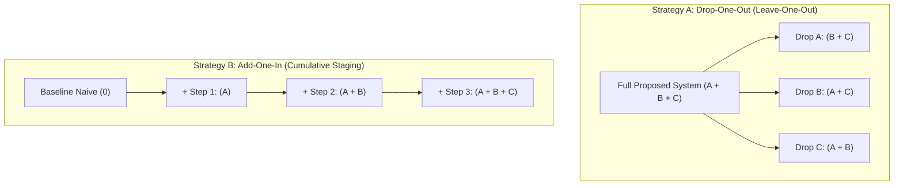

# 🧩 Ablation Study Execution Protocol

## 1. Concept & Purpose

An **Ablation Study** isolates the contribution of each individual component in a complex system. When an agent implements an optimization consisting of 3 techniques (e.g., SIMD Vectorization + Memory Pooling + Lock-Free Queue), claiming a $5\times$ speedup without ablation is unscientific.

The question must be answered: **Which component actually provided the gain, and which ones added unnecessary complexity?**

---

## 2. Two Ablation Strategies



### Strategy A: Drop-One-Out (Recommended for Mature Architectures)
* Start with the full implementation.
* Disable exactly one feature via compile-time flag, feature toggle, or mock bypass.
* Measure the degradation ($\Delta$). If disabling a feature causes zero statistical degradation, that feature is dead weight and must be pruned per `R_CORE` / `lazy-minimalism-protocol.md`.

### Strategy B: Add-One-In (Recommended for Progressive Optimization)
* Start from a clean, unoptimized baseline.
* Introduce one isolated technique per stage, measuring cumulative and marginal gains.

---

## 3. The 4-Step Ablation Execution Workflow

### Step 1: Feature Flagging / Parameterization
Expose components as toggleable options in the test harness or benchmark driver:

```csharp
public sealed class PipelineConfig
{
    public bool EnableSimd { get; set; } = true;
    public bool EnableArrayPool { get; set; } = true;
    public bool EnableLockFreeQueue { get; set; } = true;
    public bool EnablePrefetching { get; set; } = true;
}
```

### Step 2: Automated Grid Execution
Execute the benchmark matrix sequentially with identical dataset and pinned CPU cores:

```bash
# Automated ablation runner
node run-ablation.js --config=all-enabled      --runs=30
node run-ablation.js --disable=simd            --runs=30
node run-ablation.js --disable=array-pool      --runs=30
node run-ablation.js --disable=lock-free-queue --runs=30
```

### Step 3: Marginal Contribution Computation
Calculate the relative performance contribution ($C_i$) of component $i$:

$$C_i = \frac{T_{\text{Full}} - T_{\text{Without } i}}{T_{\text{Full}}} \times 100\%$$

### Step 4: Architectural Pruning
* If $C_i < 2\%$ and the component introduces $>50$ lines of complex unsafe/pointer code, **remove the component**.
* Do not keep speculative complexity in the codebase.

---

## 4. Standard Publication-Grade Ablation Table

```markdown
| Configuration | Throughput (K ops/s) | p99 Latency (µs) | Memory Alloc (MB) | Marginal Gain (%) | Decision |
| :--- | :--- | :--- | :--- | :--- | :--- |
| **Full Pipeline (All Features)** | **420.5 ± 4.2** | **3.1** | **0.00** | **Baseline SOTA** | **Retained** |
| └── Drop: AVX2 SIMD | 185.2 ± 3.8 | 7.4 | 0.00 | -55.9% | Essential (Keep) |
| └── Drop: ArrayPool Buffer | 398.1 ± 6.1 | 14.8 (GC spikes) | 48.50 | -5.3% (GC Risk) | Essential (Keep) |
| └── Drop: SPSC Lock-Free Queue | 412.0 ± 5.0 | 3.4 | 0.00 | -2.0% | Borderline (Keep) |
| └── Drop: Software Prefetching | 419.8 ± 4.5 | 3.1 | 0.00 | -0.16% | **PRUNED (No gain)**|
```
