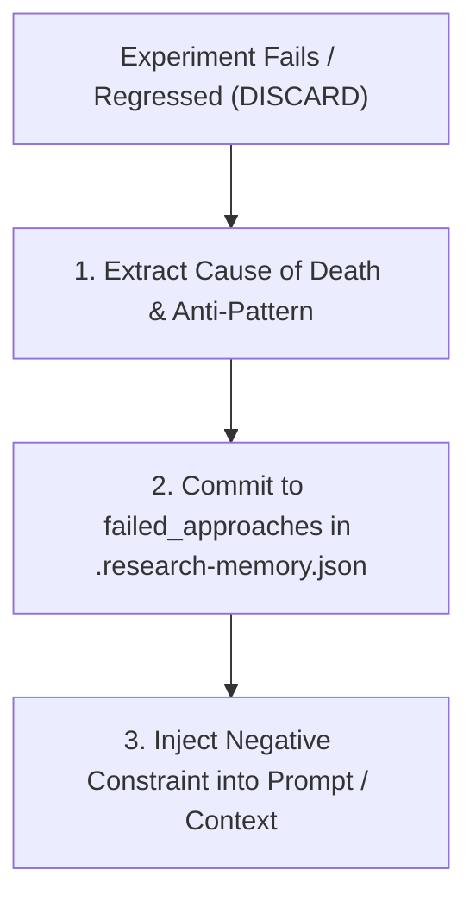

# 🚫 Failed Approach & Negative Memory Playbook

## 1. Core Principle: "Cái này thử rồi, đừng làm lại"

The primary competitive edge of experienced senior human software engineers over AI agents is **negative intuition**:
* A junior engineer or an LLM sees a slow loop and thinks: *"Let's try OpenMP multi-threading!"*
* A senior engineer instantly objects: *"We tried that three months ago; the thread synchronization overhead in this microsecond hot-loop killed performance. Don't do it."*

This playbook operationalizes **Negative Memory** so agents automatically possess this defensive reflex.

---

## 2. The 3-Step Negative Memory Workflow



### Step 1: Deep Causal Extraction (Cause of Death)
Never log a superficial failure reason (e.g. "It didn't work"). Identify the exact physical or architectural mechanism:
* *Bad:* "Loop unrolling failed."
* *Good:* "Manual loop unrolling of PopCount AVX2 by 4 accumulators increased code size from 128B to 512B, causing L1 instruction cache thrashing while out-of-order execution units were already port-saturated."

### Step 2: Formulating the Forbidden Pattern Signature
Extract the abstract pattern signature so the agent recognizes future variants:

```json
{
  "id": "FAIL-017",
  "approach_name": "Manual AVX2 Loop Unrolling in PopCount Kernel",
  "tested_in_experiment": "EXP-017",
  "cause_of_death": "L1I cache pressure and micro-op queue saturation with zero instruction latency hiding.",
  "forbidden_pattern": "manual_loop_unroll(SIMD, width >= 4, kernel_size <= 256B)",
  "scope_condition": "Modern out-of-order x86_64 CPUs (Intel Core 12th+ Gen, AMD Zen 3+)"
}
```

### Step 3: Generating Active Negative Constraints
When authoring the next prompt or planning the next task, convert failed approaches into explicit **Negative Directives**:

```text
[NEGATIVE CONSTRAINT - ENFORCED BY R_RES_MEM]
The following approaches have been EMPIRICALLY DISPROVEN and are STRICTLY FORBIDDEN:
1. FAIL-004: Do NOT use OpenMP multi-threading inside loops with payload < 5µs (sync overhead dwarfs compute).
2. FAIL-012: Do NOT replace _mm_popcnt_u64 with memory lookup tables (L1 cache thrashing).
3. FAIL-017: Do NOT manually unroll PopCount AVX2 loops (micro-op saturation).
Any candidate plan violating these constraints will be rejected at pre-flight check.
```

---

## 3. Pattern Matching Heuristic (Pre-Flight Check)

Before modifying code, the agent must run this self-check:

```text
PROPOSED PLAN: "Let's optimize the matrix multiply by unrolling the inner loop 8 times."
MATCHING QUERY against .research-memory.json:
- Keyword match: "unroll", "loop"
- Found: FAIL-017 (forbidden_pattern: manual_loop_unroll)
VERDICT: CONFLICT DETECTED.
ACTION: HALT PLAN. Disclose conflict to user or pivot to cache blocking (tiling) instead.
```
