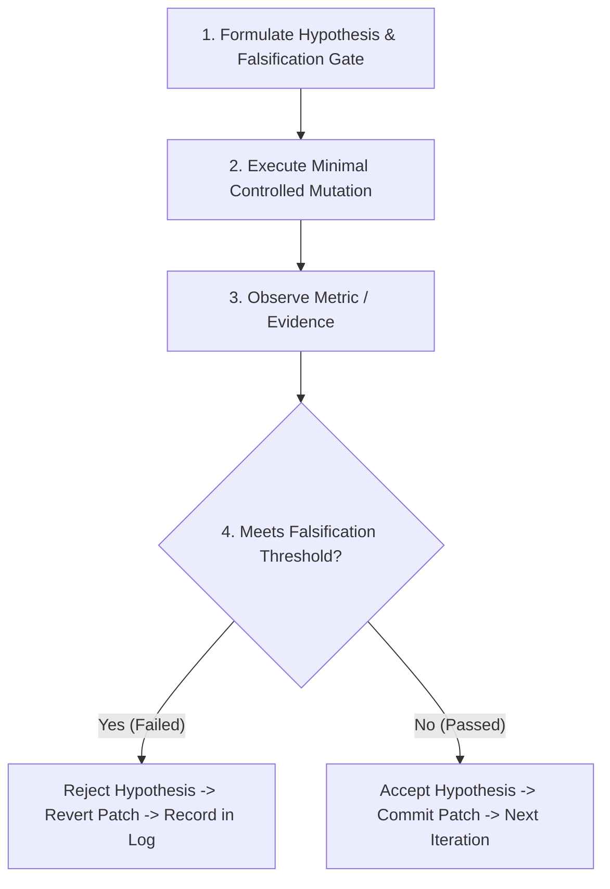

# 🧪 Hypothesis-Driven Engineering Playbook

## 1. Context & Motivation

AI Coding Agents often attempt code modifications reactively ("Let's try this and see if it works"). This unstructured trial-and-error causes regression cascades, amnesia loops, and wasted inference tokens. 

**Hypothesis-Driven Engineering** forces the agent to establish a formal causal hypothesis before making any code edits.

---

## 2. The 4-Step Hypothesis Cycle



### Step 1: Pre-Execution Hypothesis Declaration
Before modifying any source code, declare the hypothesis in working memory:

```yaml
hypothesis_id: H-042
question: "Why does the image downsampling routine stutter during tile extraction?"
causal_mechanism: "Sub-optimal memory layout causing L2 CPU cache misses due to row-major iteration across column-major pixel strides."
proposed_fix: "Transpose the inner iteration loop to match native buffer stride."
falsification_threshold:
  metric: "Elapsed time per 4K frame"
  target: "<= 8.2 ms (current: 24.6 ms)"
  rejection_condition: "If elapsed time > 12.0 ms or memory bandwidth exceeds 15 GB/s, REJECT hypothesis."
```

### Step 2: Minimal Controlled Mutation
* Apply the **shortest working diff** that tests the hypothesis (per `lazy-minimalism-protocol.md`).
* Do not introduce opportunistic cleanups, refactorings, or unrelated optimizations in the same experiment.

### Step 3: Counter-Factual Scenario Testing
Stress-test the hypothesis against edge cases to prevent false positives:
* **Empty Input:** Zero-sized buffers or empty vectors.
* **Maximum Pressure:** Peak allocation or 100% thread saturation.
* **Adversarial Ordering:** Reverse-sorted data, unaligned memory addresses, or non-power-of-two strides.

### Step 4: Decision & Journaling
* **If Falsified:** Immediately revert working directory (`git checkout -- <file>`). Do NOT attempt a second ad-hoc fix on top of a failed patch. Log the negative result into the project's hypothesis journal.
* **If Verified:** Verify that no regressions were introduced across the broader test suite, commit atomically, and update benchmarks.

---

## 3. Working Memory Hypothesis Log Example

```markdown
### Active Investigation Log (Task: Memory Pool Leak)

- **[H-001 - FAILED]** *Hypothesis:* Free list pointer cycle causes memory exhaustion.
  - *Experiment:* Added cycle detection via Floyd's tortoise-hare algorithm in `pool_free()`.
  - *Observation:* No cycle detected before crash. Exit code -1073741819 (Access Violation).
  - *Conclusion:* Rejected H-001. Pointer cycle is not the root cause. Reverted.

- **[H-002 - VERIFIED]** *Hypothesis:* Double-free occurring across thread boundaries due to missing memory barrier on block release.
  - *Experiment:* Added atomic compare-and-swap (`atomic_compare_exchange_strong`) on block metadata byte.
  - *Observation:* Ran 1,000,000 concurrent iterations without a single crash. Error rate dropped from 4.2% to 0.00%.
  - *Conclusion:* Accepted H-002. Root cause verified. Atomic state machine committed.
```
