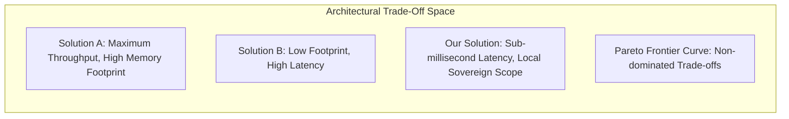

# 🧭 Prior-Art Gap Analysis & Pareto Frontier Mapping

## 1. Context & Rationale

In software engineering and systems architecture, **no solution is superior in all dimensions**. Any claim that a new system is "faster, simpler, smaller, and more feature-rich than all competitors simultaneously" is an immediate architectural red flag.

Engineering is the science of **conscious trade-offs**. The **Prior-Art Gap Analysis** establishes an architectural Pareto frontier, proving where the proposed system outperforms competitors and explicitly acknowledging where it sacrifices generality.

---

## 2. Constructing the Pareto Frontier



### The 4 Evaluation Dimensions
1. **Time Complexity & Latency:** Microseconds per operation, worst-case tail latency ($p_{99}$).
2. **Space & Memory Footprint:** Static binary size, dynamic heap allocations ($B/\text{op}$), working set size.
3. **Engineering Complexity & Invariants:** Lines of code, safety proofs, compiler-checked invariants.
4. **Operational Sovereignty:** External dependencies, network isolation, cross-platform portability.

---

## 3. The 4-Step Gap Analysis Protocol

### Step 1: Competitor Selection
Identify 2 to 3 industry baselines representing the existing dominant paradigms:
* **Incumbent Baseline:** The established legacy standard (e.g., standard C HAL, Entity Framework, PostgreSQL).
* **Modern SOTA Baseline:** The state-of-the-art alternative (e.g., Rust embedded-hal, Dapper, Qdrant).

### Step 2: Feature & Constraint Decomposition
Map the technical capabilities across binary/scalar axes:

```markdown
| Capability / Constraint | Baseline A (EF Core) | Baseline B (Dapper) | Proposed Architecture (LiteSql) |
| :--- | :--- | :--- | :--- |
| **Mapping Engine** | Dynamic Reflection & LINQ AST | Fast IL Emit Object Mapper | Source-Generated Direct Caching |
| **Change Tracking** | Heavy Snapshot / State Manager | None (Manual SQL writes) | Lightweight Snapshot Array Pool |
| **Async Overhead** | Task Allocations in State Machine | Zero Task Allocations | ValueTasks throughout hot paths |
| **Memory per 10k rows**| ~24.5 MB | ~8.2 MB | ~4.1 MB (Span<T> chunked) |
| **API Familiarity** | LINQ / Fluent API | Raw SQL strings | LINQ to SQL (.dbml parity) |
```

### Step 3: Formal Trade-Off Articulation
State the explicit architectural sacrifices:
* *"We consciously sacrifice distributed scale-out clustering to achieve zero-serialization in-process access via `mmap`."*
* *"We consciously sacrifice dynamic runtime schema migrations in favor of compile-time verified source generation."*

### Step 4: The Architectural Niche Formulation
State the exact condition under which an engineering team MUST choose your solution over competitors:
* *"Choose Solution X when the workload requires deterministic real-time sub-millisecond memory retrieval within an edge device possessing $< 512\text{ MB}$ RAM, where Docker/network daemons are prohibited."*
