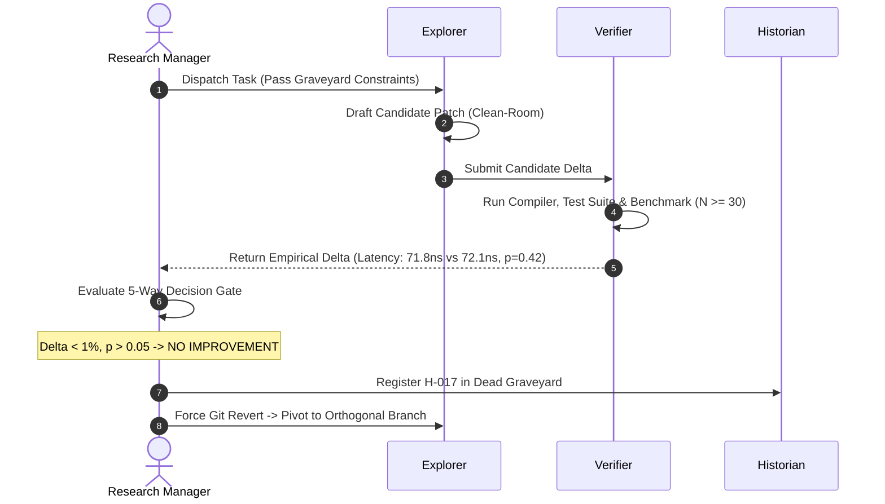

# 🧭 Research Manager Operational Protocol

## 1. Executive Summary & Problem

When autonomous AI agents encounter stubborn bottlenecks (e.g., benchmark latency, elusive concurrency race, memory exhaustion), their default behavior is to produce repetitive, incremental mutations of the same flawed intuition. 

This protocol implements the **Research Manager** decision loop inside the agent's working memory, enforcing explicit tracking of the **Dead Hypothesis Graveyard** and halting dead loops before they consume token budgets.

---

## 2. Working Memory State Machine Schema

During research or deep-investigation sessions, the agent must maintain this state structure in its working memory:

```yaml
research_session:
  goal: "Reduce sub-millisecond vector Hamming scan latency below 50ns"
  active_hypothesis: "H-017"
  consecutive_stalls: 1 # Threshold: >= 2 triggers mandatory DISCARD
  budget:
    max_experiments: 20
    current_experiment: 17
  
  dead_hypothesis_graveyard:
    - id: "H-004"
      concept: "Multi-threaded OpenMP parallelization inside inner Hamming loop"
      cause_of_death: "Thread synchronization overhead (1.2µs) dwarfs 80ns compute payload"
      forbidden_pattern: "Do not introduce thread dispatch inside microsecond loops"
    - id: "H-012"
      concept: "Look-up table (LUT) for PopCount64"
      cause_of_death: "L1 cache thrashing; hardware _mm_popcnt_u64 instruction is 4x faster"
      forbidden_pattern: "Do not replace native hardware intrinsic with memory table"

  active_trajectory:
    hypothesis: "H-017: Unroll PopCount AVX2 loop to 4 accumulators to hide latency"
    falsification_threshold: "Latency must drop below 60ns (baseline: 72ns)"
```

---

## 3. Step-by-Step Decision Gate Execution



### Scenario: The "Experiment #17" Dilemma

#### 1. The Observation (Verifier Report)
```text
[VERIFIER REPORT: Experiment #17]
- Candidate: Loop unrolling with 4 AVX2 accumulators
- Runs: N=50
- Baseline Median: 72.1 ns ± 1.4 ns
- Candidate Median: 71.8 ns ± 1.6 ns
- Delta: -0.4% (p = 0.42, Statistically Insignificant)
- Stalls on H-017: 2 (Initial: 73.0ns, Unroll: 71.8ns)
```

#### 2. The Research Manager Intervention
* The Manager evaluates:
  1. Is $p < 0.05$? **No ($p = 0.42$).**
  2. Is $|\Delta| \ge 5\%$? **No ($-0.4\%$).**
  3. Consecutive stalls on $H-017 \ge 2$? **Yes ($K = 2$).**
* **The Manager Decision: `DISCARD`**
  * Prohibit any further loop unrolling micro-tweaks (e.g., "try unrolling 8 times instead of 4").
  * **Execute Rollback:** `git checkout -- <modified_files>` immediately.

#### 3. Historian Graveyard Update
The Historian records:
```markdown
- **[H-017 - DEAD]**
  - *Concept:* Manual loop unrolling of AVX2 PopCount accumulators.
  - *Cause of Death:* Out-of-order execution engine already saturates port 0/1; manual unrolling adds code bloat without hiding instruction latency.
  - *Forbidden:* Do not manually unroll AVX2 loops in vector scan kernels.
```

#### 4. Directing the Explorer to an Orthogonal Branch
The Manager prompts the Explorer with clean-room instructions and explicit negative constraints:
* *"Hypothesis H-017 is DEAD and reverted. Do NOT attempt loop unrolling or register reordering.*
* *Explore an orthogonal architectural angle: e.g., 1-bit BQ Hamming quantization or SIMD cache-line prefetching."*

---

## 4. The 5 Decision Directives

When authoring responses or executing tasks, the agent acting as **Research Manager** must output its structured determination:

| Decision Code | When to Trigger | Immediate Required Action |
| :--- | :--- | :--- |
| **`DECISION: CONTINUE`** | $p < 0.05$, $\Delta \ge 5\%$ improvement | Commit milestone; advance to next logical phase on current branch. |
| **`DECISION: PIVOT`** | Algorithmic win but blocked by orthogonal bottleneck | Preserve insights in Historian; rotate angle (e.g. from CPU algorithm to memory layout). |
| **`DECISION: MERGE`** | Multiple independent branches succeed orthogonally | Combine into unified patch; run regression verifier on joint synergy. |
| **`DECISION: DISCARD`** | Regressed or stalled ($K \ge 2$ non-improving tries) | Git revert all files; mark DEAD in Graveyard; forbid re-traversal. |
| **`DECISION: STOP`** | Target metric reached OR diminishing returns ($\Delta < 1\%$) | Freeze code; write final verification walkthrough; declare task complete. |
