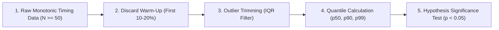

# 📊 Statistical Benchmark Analysis & Noise Elimination

## 1. Context & Pitfalls of Naive Benchmarking

Software performance measurement is notoriously noisy. Context switches, CPU frequency governors, JIT warm-up, and OS page faults can skew single-run numbers by $20\% – 300\%$.

### The 4 Fatal Pitfalls
1. **Reporting Arithmetic Mean of Multi-Modal Data:** If 99 requests take $1\text{ ms}$ and 1 request takes $100\text{ ms}$, the mean ($1.99\text{ ms}$) conceals the catastrophic tail latency.
2. **Measuring Cold Runs:** Including JIT tiering and disk cache faulting in steady-state metrics.
3. **Small Sample Sizes ($N < 10$):** High variance creates false-positive "optimizations."
4. **Uncalibrated Clocks:** Using `DateTime.Now` ($15\text{ ms}$ resolution) instead of monotonic high-resolution hardware counters (`Stopwatch.GetTimestamp()` or `rdtsc`).

---

## 2. Statistical Pipeline



### 2.1 Warm-Up Discard Rule
* Discard the first $20\%$ of runs or until three consecutive runs show a moving standard deviation $\sigma < 3\%$.
* Only steady-state execution iterations are included in the empirical sample.

### 2.2 Outlier Filtering via Interquartile Range (IQR)
Calculate the first quartile ($Q_1$) and third quartile ($Q_3$):

$$\text{IQR} = Q_3 - Q_1$$
$$\text{Lower Bound} = Q_1 - 1.5 \times \text{IQR} \quad\Big|\quad \text{Upper Bound} = Q_3 + 1.5 \times \text{IQR}$$

* Tag and investigate outliers exceeding the upper bound (indicative of GC pauses, thread contention, or page faults).
* Report both **Raw Dataset** (including tail) and **Trimmed Dataset**.

### 2.3 Required Metric Suite

| Metric | Representation | Purpose |
| :--- | :--- | :--- |
| **$N$** | Integer $\ge 30$ | Sample size guaranteeing statistical validity. |
| **Median ($p_{50}$)** | Time / Throughput | Central tendency robust against tail outliers. |
| **$p_{90}, p_{95}, p_{99}$** | Time in µs / ns | Tail latency reflecting worst-case real-world experience. |
| **IQR / StdDev ($\sigma$)**| Dispersion | Measure of run-to-run jitter and system predictability. |
| **Throughput** | Ops/sec or MB/sec | Work volume scaled over wall-clock duration. |

---

## 3. Comparative Significance Testing

When comparing Implementation $A$ (Baseline) against Implementation $B$ (Optimized):

```javascript
// Pseudocode: Mann-Whitney U Test for Non-Parametric Benchmark Data
function isStatisticallySignificant(samplesA, samplesB, alpha = 0.05) {
  const pValue = computeMannWhitneyUTest(samplesA, samplesB);
  const medianA = computeQuantile(samplesA, 0.5);
  const medianB = computeQuantile(samplesB, 0.5);
  const deltaPercent = ((medianB - medianA) / medianA) * 100;

  return {
    significant: pValue < alpha,
    pValue,
    deltaPercent,
    verdict: (pValue < alpha && deltaPercent < -5.0) ? 'CONFIRMED_FASTER' : 'INCONCLUSIVE_OR_REGRESSED'
  };
}
```

* **Condition for claiming victory:** $p < 0.05$ **AND** $|\text{delta}| \ge 5\%$.
* If $|\text{delta}| < 5\%$ even with $p < 0.05$, classify as **"Performance Inconclusive / Noise Threshold."**
