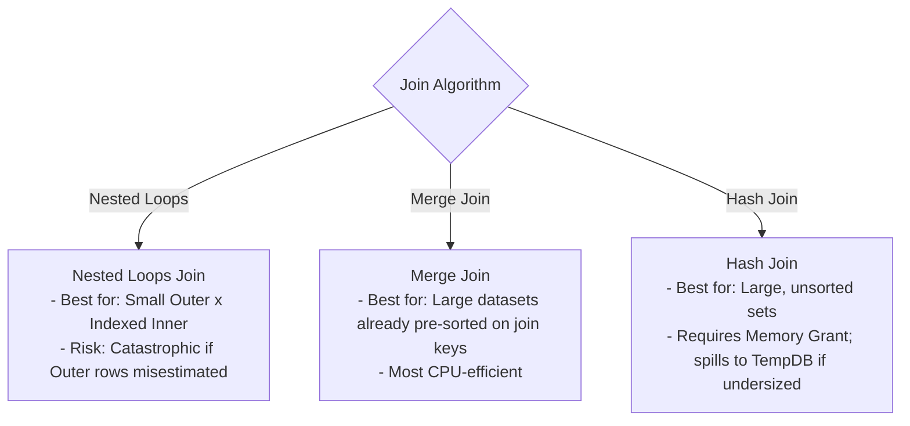

# 🔍 SQL Server Execution Plan Diagnosis & Analysis Standards

**Goal:** Establish an objective, systematic protocol for diagnosing performance regressions, high I/O bottlenecks, and suboptimal query plans in SQL Server 2012+.

---

## 1. Plan Capture & Baseline Metrics Protocol

Before inspecting visual plans, always capture deterministic execution statistics:

```sql
SET STATISTICS IO ON;
SET STATISTICS TIME ON;

-- Execute query here

SET STATISTICS IO OFF;
SET STATISTICS TIME OFF;
```

### Key Metrics to Audit:
1. **Logical Reads:** The count of 8 KB pages read from the buffer cache. The primary metric for query efficiency. (1,000 logical reads $\approx 8$ MB of data processed).
2. **Physical Reads:** Pages read from physical disk (indicates cold cache or memory pressure).
3. **CPU Time vs Elapsed Time:**
   - If $\text{CPU Time} > \text{Elapsed Time}$: Query executed in **parallel** across multiple cores.
   - If $\text{Elapsed Time} \gg \text{CPU Time}$: Query was blocked waiting on locks, disk I/O, network, or memory grants.
4. **Scan Count:** Number of times an index or table was accessed. A high scan count in an inner loop indicates an inefficient Nested Loops Join.

---

## 2. Execution Plan Red Flag Matrix

When reviewing graphical or XML execution plans, immediately search for these high-severity indicators:

| Red Flag | Visual Indicator | Root Cause | Architectural Remediation |
| :--- | :---: | :--- | :--- |
| **Table Scan / Clustered Index Scan** | Thick arrow + Scan icon | Missing index or non-SARGable predicate forcing full table read. | Create targeted Non-Clustered index or rewrite `WHERE` clause. |
| **Key Lookup (Clustered)** | Lookup icon with high % cost | Index seek found matching rows, but missing non-key columns needed by `SELECT`. | Add missing columns to index using `INCLUDE (col1, col2)`. |
| **RID Lookup (Heap)** | Lookup icon on heap table | Table has no Clustered Index; fetches row by physical Row ID. | Create a Clustered Index on the primary identity key. |
| **TempDB Spill (Sort/Hash)** | Yellow Warning Triangle ⚠️ | Insufficient memory grant; SQL Server spilled sorting/hashing to TempDB disk. | Update outdated statistics; eliminate unnecessary `ORDER BY`; split query. |
| **Implicit Conversion** | Yellow Warning Triangle ⚠️ | Data type mismatch between parameter and column (`VARCHAR` vs `NVARCHAR`). | Align application parameter types with schema column types. |
| **Cardinality Divergence** | Actual Rows $\gg$ Estimated Rows | Stale statistics, complex multi-column correlation, or parameter sniffing. | Update statistics with `FULLSCAN`; break query with `#Temp` table. |

---

## 3. Key Lookup (Bookmark Lookup) Elimination

A **Key Lookup** occurs when a Non-Clustered index fulfills the `WHERE` clause, but the query requires additional columns not present in that index. For each row, the engine must perform an additional random I/O read into the Clustered Index.

```
[Non-Clustered Index Seek] ──(10,000 Rows)──> [Key Lookup (Clustered)] ──> [Output]
                                                      ▲
                                                      │ (10,000 Random I/O Seeks!)
```

### The Covering Index Fix:
```sql
-- ❌ Incomplete Index: Causes Key Lookup for UnitPrice and Status
CREATE NONCLUSTERED INDEX IX_Orders_CustomerId ON Orders(CustomerId);

-- Query:
SELECT OrderId, OrderDate, UnitPrice, Status 
FROM Orders 
WHERE CustomerId = @CustomerId;

-- ✅ Covering Index: Fully satisfies query in 1 index seek with 0 lookups
CREATE NONCLUSTERED INDEX IX_Orders_CustomerId_Covering 
ON Orders(CustomerId) 
INCLUDE (OrderId, OrderDate, UnitPrice, Status);
```

---

## 4. Join Operator Diagnostics

Understanding how SQL Server joins data sets allows identifying whether an inefficient join algorithm was chosen:



### Diagnostics Rules:
- **Nested Loops with Clustered Index Scan on Inner Side:** Always an emergency. Indicates missing index on join key.
- **Hash Join on Small Tables (< 50 rows):** Indicates missing indexes on both sides or severely distorted cardinality estimates.
- **Merge Join with Explicit Sort Node:** The optimizer added a costly in-memory sort to satisfy Merge Join. Consider creating an index that pre-sorts the data.

---

## 5. Scalar UDF Penalty

In SQL Server 2012, Scalar User-Defined Functions (`dbo.fn_CalculateTax(Amount)`):
- Force the query to run in **single-threaded** mode (disables parallelism).
- Execute row-by-row (**RBAR** - Row By Agonizing Row).
- Hide their internal cost in execution plan estimates (shows as 0% cost, but consumes 95% elapsed time).

**Standard Rule:** Replace Scalar UDFs with **Inline Table-Valued Functions (iTVF)** or inline scalar expressions.
