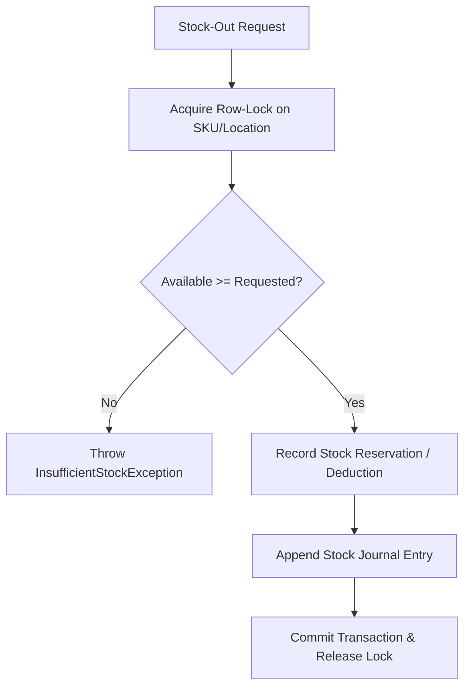

# 📦 Enterprise Inventory & Warehouse Movement Invariants

> **Scope:** Warehouse ledger management, stock movements (In/Out/Transfer), locking discipline, and physical vs ledger reconciliation.

---

## 🏛️ 1. Core Architectural Invariants

### 1.1 Ledger Immutability & Double-Entry Balance
- Inventory balances MUST NEVER be updated through arbitrary direct overwrite of balance fields without an accompanying immutable transaction ledger record (`tblStockJournal` or `tblMaterialInOut`).
- **Invariant:** `CurrentBalance = InitialBalance + SUM(StockIn) - SUM(StockOut)`.
- If an inventory count error is discovered, it MUST be reconciled via an explicit `AdjustmentJournal` entry with signed supervisor authorization, never by editing past transactions.

### 1.2 Pessimistic Row Locking on Stock Depletion
- Concurrent stock-out or reservation requests against the same SKU/Material ID MUST employ strict pessimistic row-level locking to prevent negative stock race conditions:
  ```sql
  -- SQL Server Row-Level Lock Pattern
  SELECT CurrentQuantity, ReservedQuantity 
  FROM tblWarehouseStock WITH (UPDLOCK, ROWLOCK)
  WHERE WarehouseId = @WarehouseId AND MaterialId = @MaterialId;
  ```
- In code, encapsulate balance checks and ledger journal insertions within an atomic `DbTransaction`.

### 1.3 Strict Prohibition of Negative Inventory
- Negative stock is strictly prohibited unless the warehouse location is explicitly configured as a virtual transit buffer.
- `AvailableQuantity = CurrentQuantity - ReservedQuantity`.
- Any attempt to allocate or stock-out where `RequestedQuantity > AvailableQuantity` MUST throw a domain exception (`InsufficientStockException`) before touching the database.

---

## ⚙️ 2. Stock Movement Protocols



### 2.1 FIFO / LIFO Batch Valuation
- Valuation methods (FIFO, LIFO, Weighted Average) MUST track unit costs at the receipt batch level.
- Outbound items must deplete the oldest unexhausted batch receipts sequentially to preserve accurate Cost of Goods Sold (COGS).

### 2.2 Atomic Lot & Serial Reservation
- When an order allocates lot-tracked or serial-tracked items, reservations must immediately bind to specific `LotNo` or `SerialNo` entries.
- Reserved items cannot be cross-allocated to subsequent orders even if physical handover has not yet occurred.

---

## 🛡️ 3. Verification & Auditing Contracts
- Every stock-in and stock-out method MUST accept a valid `CancellationToken` and execute within a scoped transaction.
- Audit columns (`CreatedBy`, `CreatedAt`, `TransactionSource`, `ReferenceDocNo`) are non-nullable on every journal row.
- Unit and integration tests must simulate concurrent threads attempting to deplete a single SKU with limited quantity to verify deadlock defense and zero negative stock.
