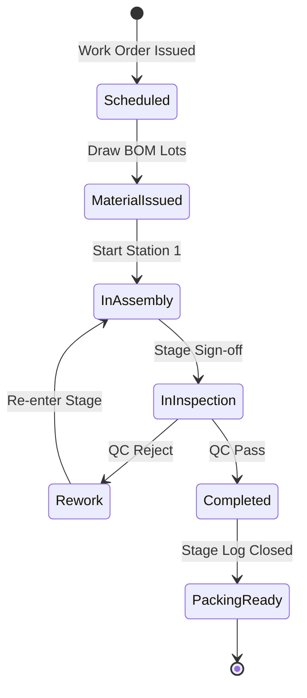

# 🏭 Enterprise Production Lot & Serial Lifecycle Traceability Standards

> **Scope:** Manufacturing execution, stage-by-stage lot tracking, Bill of Materials (BOM) material consumption, inspection handovers, and scrap governance.

---

## 🏛️ 1. Core Architectural Invariants

### 1.1 Unbroken Lineage Invariant (Raw Material $\to$ Finished Good)
- Every manufactured finished product unit (represented by `LotNo` or `SerialNo`) MUST maintain a deterministic parent-child relationship graph tracing back to:
  1. Specific production order and work center schedule.
  2. Exact input material lot numbers consumed per the active BOM revision.
  3. Quality control (QC) inspection test records and technician sign-offs.

### 1.2 Immutable Stage Transition Gates
- A production lot cannot advance to the next manufacturing stage (e.g., Assembly $\to$ Coating $\to$ Packaging) without an explicit stage sign-off recorded in the routing journal (`tblProductionStageLog`).
- Skipping stages or retroactive stage insertion without supervisor override creates an immediate audit violation.

### 1.3 Material Substitution & Scrap Rules
- Substituting an alternative component not defined in the current BOM revision requires an engineering change order (ECO) reference ID.
- Defective scrap generated at any station MUST be recorded in real-time with quantity, defect category code, and timestamp before replacement materials can be drawn from inventory.

---

## ⚙️ 2. Lifecycle State Machine

### 2.1 Bill of Materials (BOM) Consumption Tracking
- Backflushing (automatic consumption upon completion) is ONLY permitted for non-traceable bulk items (e.g., screws, bulk adhesive).
- High-value, safety-critical, or serial-tracked components MUST be explicitly scanned/logged at the point of assembly.

### 2.2 Traceability Query Performance
- The database schema MUST provide bidirectional indexing:
  - **Forward Traceability:** Given a raw material lot, retrieve all finished product lots and shipped customers within <500ms.
  - **Backward Traceability:** Given a customer serial number, retrieve all component lots, machine IDs, and operator IDs within <500ms.

---

## 🛡️ 3. Verification & Compliance
- Data integrity checks must assert that `SUM(MaterialConsumed) = BOMStandardQuantity * UnitsProduced + ScrapQuantity`.
- Unit tests must verify that invalid state transitions (e.g., attempting to complete a lot before QC inspection approval) throw domain validation errors.
