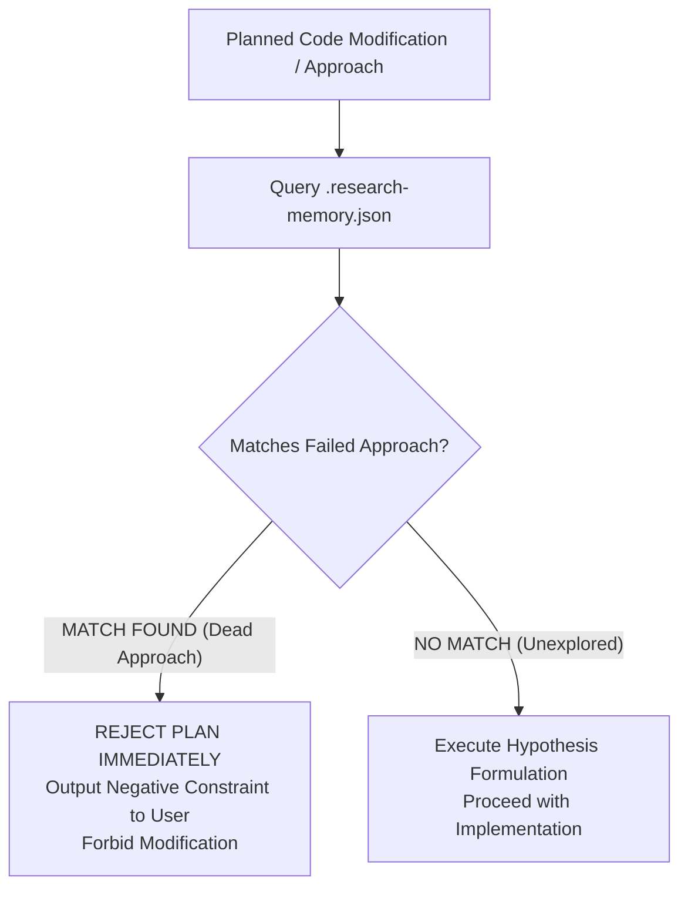

# 📜 Research Memory Standard

## 1. Context & Rationale

In autonomous agent operations, **negative knowledge is as valuable as positive code**. Repeating a known failed experiment wastes engineering time and token budgets. 

This standard governs the structure, persistence, and querying of **Research Memory** across all projects adopting the AgentOption framework.

---

## 2. The "Query-Before-Action" Invariant

Before an agent touches source code or drafts an architectural modification for any non-trivial bug fix, refactoring, or optimization task:

$$\text{Agent Action} \xrightarrow{\quad\text{MUST EXECUTE}\quad} \text{Query}(\text{`.research-memory.json`}, \text{Planned Pattern})$$



* If the planned action matches an existing `failed_approach` with identical constraints:
  * The agent is **strictly prohibited** from proceeding.
  * The agent must output an immediate notice:
    `[NEGATIVE MEMORY HIT] Approach 'X' was previously attempted in Experiment #Y and failed due to Z. Re-attempting is blocked.`

---

## 3. Standard JSON Schema (`.research-memory.json`)

```json
{
  "$schema": "https://json-schema.org/draft/2020-12/schema",
  "title": "ResearchMemory",
  "type": "object",
  "required": ["project", "version", "hypotheses", "failed_approaches"],
  "properties": {
    "project": { "type": "string" },
    "version": { "type": "string" },
    "hypotheses": {
      "type": "array",
      "items": {
        "type": "object",
        "required": ["id", "claim", "status"],
        "properties": {
          "id": { "type": "string" },
          "claim": { "type": "string" },
          "status": {
            "type": "string",
            "enum": ["proposed", "testing", "verified", "partially_verified", "falsified", "dead"]
          },
          "causal_mechanism": { "type": "string" },
          "evidence_refs": { "type": "array", "items": { "type": "string" } },
          "limitations": { "type": "array", "items": { "type": "string" } }
        }
      }
    },
    "failed_approaches": {
      "type": "array",
      "items": {
        "type": "object",
        "required": ["id", "approach_name", "cause_of_death", "forbidden_pattern"],
        "properties": {
          "id": { "type": "string" },
          "approach_name": { "type": "string" },
          "tested_in_experiment": { "type": "string" },
          "cause_of_death": { "type": "string" },
          "forbidden_pattern": { "type": "string" },
          "scope_condition": { "type": "string" }
        }
      }
    },
    "assumptions": {
      "type": "array",
      "items": {
        "type": "object",
        "required": ["id", "statement", "status"],
        "properties": {
          "id": { "type": "string" },
          "statement": { "type": "string" },
          "status": { "type": "string", "enum": ["assumed", "validated", "violated"] }
        }
      }
    },
    "contradictions": {
      "type": "array",
      "items": {
        "type": "object",
        "required": ["id", "description", "divergent_environments"],
        "properties": {
          "id": { "type": "string" },
          "description": { "type": "string" },
          "divergent_environments": { "type": "array", "items": { "type": "string" } }
        }
      }
    },
    "decisions": {
      "type": "array",
      "items": {
        "type": "object",
        "required": ["id", "decision", "rationale", "timestamp"],
        "properties": {
          "id": { "type": "string" },
          "decision": { "type": "string", "enum": ["Continue", "Pivot", "Merge", "Discard", "Stop"] },
          "rationale": { "type": "string" },
          "timestamp": { "type": "string" }
        }
      }
    }
  }
}
```

---

## 4. Promotion & Maintenance Protocol

1. **Promotion to Standards (`standards/`):** When a hypothesis is marked `verified` across multiple environments ($N \ge 30, p < 0.01$), the agent must promote the pattern into a permanent language standard or skill.
2. **Graveyard Immutability:** Entries in `failed_approaches` are **immutable**. They may only be updated to broaden their `forbidden_pattern` signature, never deleted.
3. **Branch Merging:** During git branch merges, `.research-memory.json` entries must be union-merged (set union on IDs) so that failed experiments on feature branches are preserved on `main`.
