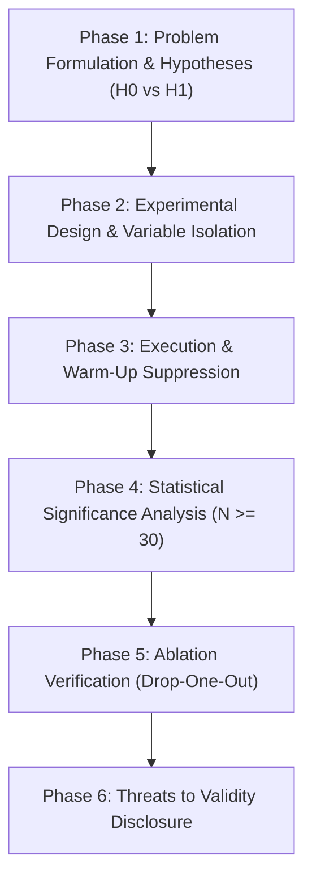

# 🔬 Scientific Research & Empirical Methodology Standard

## 1. Core Principles

Autonomous AI coding agents conducting technical research, performance tuning, or architectural investigations must operate as **empirical scientists**. Intuition, unmeasured assertions, and post-hoc rationalizations are strictly forbidden.

1. **Popperian Falsifiability:** Every hypothesis must declare explicit, measurable conditions under which it is proven false before experimentation begins.
2. **Reproducibility Invariant:** Any external researcher with identical hardware and software dependencies must obtain statistical results within $\pm 5\%$ margin of error.
3. **Controlled Isolation:** Change exactly one independent variable per experiment run. Confounding variables (OS background jobs, CPU frequency scaling, thermal throttling) must be actively suppressed.

---

## 2. The 6-Phase Scientific Research Protocol



### Phase 1: Problem Formulation & Hypothesis Definition
* State the research question unambiguously.
* Define both the **Null Hypothesis ($H_0$)** and **Alternative Hypothesis ($H_1$)**:
  * $H_0$: "The proposed SIMD vectorization yields no statistically significant difference in image transformation throughput compared to auto-vectorized C (-O3)."
  * $H_1$: "The proposed SIMD Vector256 pipeline achieves at least a $2.5\times$ increase in throughput ($p < 0.01$) over auto-vectorized C."

### Phase 2: Experimental Control & Variable Isolation
* **Independent Variable ($X$):** The single parameter manipulated (e.g., ringbuffer chunk size: 64B, 256B, 1024B, 4096B).
* **Dependent Variable ($Y$):** The measured outcome (e.g., end-to-end latency in microseconds, cache misses via PMU).
* **Controlled Variables ($C$):** Core affinity pinned (`taskset -c 2`), process priority (`nice -n -20`), fixed power profile (`performance`), deterministic random seed.

### Phase 3: Execution & Warm-Up Suppression
* Discard the first $K$ runs (minimum 5 runs or 2,000 warm-up operations) to isolate JIT compilation, disk cache priming, and memory paging effects.
* Minimum sample size: $N \ge 30$ independent runs to satisfy Central Limit Theorem (CLT).

### Phase 4: Statistical Significance & Distribution Analysis
* Never report single-run values or unadorned arithmetic means.
* Mandate: **Median**, **IQR (Interquartile Range)**, **p95 / p99 percentiles**, and **Standard Deviation ($\sigma$)**.
* For comparative claims ($A$ is faster than $B$), perform two-sample **Welch's t-test** (for normal distributions) or **Mann-Whitney U test** (for non-parametric distributions), requiring $p < 0.05$.

### Phase 5: Systematic Ablation Study
* Systematically disable or isolate each individual sub-component (e.g., disable cache, disable SIMD, disable lock-free queues) to prove the marginal contribution of each architectural innovation.

### Phase 6: Threat to Validity Disclosure
Every research report must explicitly document:
* **Internal Validity:** Potential confounding factors within the test harness.
* **External Validity:** Portability to other architectures (e.g., x86_64 AVX2 vs ARM NEON vs RISC-V).
* **Construct Validity:** Does the benchmark metric actually reflect real-world user workload?

---

## 3. Standard Research Artifact Template

```markdown
# [Research Title]

## 1. Abstract & Scope
Brief summary of hypothesis, experiment methodology, and core findings.

## 2. Hypothesis Definition
- **H0 (Null):** ...
- **H1 (Alternative):** ...
- **Falsification Threshold:** Rejected if delta < X% or p >= 0.05.

## 3. Testbed & Hardware Provenance
- CPU: Intel Core i7-13700K (16 Cores, 24 Threads @ 3.40 GHz base, 5.40 GHz boost)
- RAM: 32 GB DDR5 @ 5600 MHz
- OS: Windows 11 Enterprise (Build 22631.4169)
- Toolchain: .NET 8.0.401, GCC 13.2.0, Rustc 1.80.0

## 4. Empirical Results & Distributions
| Configuration | Runs (N) | Median Latency | p95 Latency | p99 Latency | StdDev | Throughput |
| :--- | :--- | :--- | :--- | :--- | :--- | :--- |
| Baseline (H0) | 50 | 14.2 µs | 18.5 µs | 24.1 µs | ±1.8 µs | 70.4 K op/s |
| Proposed (H1) | 50 | 4.8 µs | 6.1 µs | 7.9 µs | ±0.6 µs | 208.3 K op/s|

## 5. Ablation Matrix
| Variant | Component Dropped | Throughput | Delta vs Baseline |
| :--- | :--- | :--- | :--- |
| Full Pipeline | None | 208.3 K op/s | +195.8% |
| Ablation 1 | No SIMD (Scalar) | 112.5 K op/s | +59.8% |
| Ablation 2 | No Lock-Free Queue| 85.0 K op/s | +20.7% |

## 6. Conclusion & Threats to Validity
Summary of acceptance/rejection of H1 and documented limitations.
```
